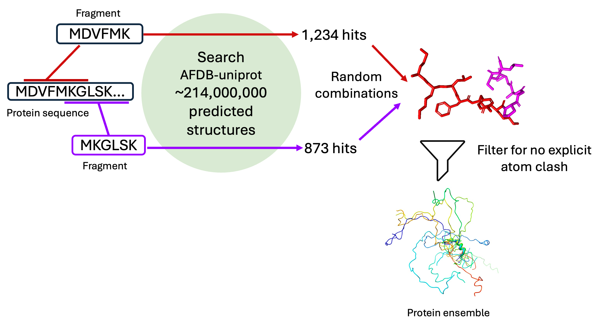

# IDP-o: Fragment-based Intrinsically Disordered Protein Ensemble Generator

[](https://www.biorxiv.org/content/10.1101/2025.10.18.680935v2) [](https://doi.org/10.5281/zenodo.17306061)

IDP-o cuts a protein sequence into 6 long fragments, with overlap of 2 residues between fragments. Searches in a structure database, then stitches those fragments together to make an ensemble of configurations. Configurations have hydrogens inferred so one can use it directly in downstream tasks.




## Build docker image
```bash
# Clone the repository
git clone https://github.com/PeptoneLtd/IDP-o
cd IDP-o

# Build Docker container
docker build --platform=linux/amd64 . -t idp-o
```

## Download the foldcomp database and generate the foldcomp fasta file
IDP-o needs a specially formatted fasta file to work properly. The format is:

```
> {offet in bytes in the foldcomp db}
{sequence}
> {offet in bytes in the foldcomp db}
{sequence}
...
```
Such file is not directly distributed by foldcomp, but can be easily generated. We provide a convenience script to automate the download of the foldcomp database and the creation of this special fasta file:

```bash
docker run -v $(pwd):/data --entrypoint python idp-o /IDP-o/scripts/prepare_foldcomp_fasta.py --workdir /data
```

This will download the `afdb_uniprot_v4` foldcomp database in the current directory (~1.1 T), and generate the `afdb_uniprot_v4.fasta` file needed to run IDP-o


## Generating ensembles
```bash
docker run -v $(pwd):/data --gpus 1 \
  idp-o \
    --sequence DLIVERANDSANDRDANDCARLDANDMICHELEANDLDHIEANDFADIDANDSTEFANDANDISTVANANDALDERTANDDLIVERAGAINPLASDTHERS \
    --outpath /data/example/ensemble.h5 \
    --scratch_folder /data/example/ \
    --foldcomp_fasta /data/afdb_uniprot_v4.fasta \
    --foldcomp_db /data/afdb_uniprot_v4 \
    --n_max_structures_per_fragment 100
```
Note: the final fragment can be smaller than 6 residues, depending on sequence length.

The script `generate_dataset.py` provides a simple wrapper for generating a full dataset, like [IDRome-o](https://zenodo.org/records/17306061).

## Citation
```bibtex
@article{peptone2025,
  title     = {Advancing Protein Ensemble Predictions Across the Order-Disorder Continuum},
  author    = {Invernizzi, Michele and Bottaro, Sandro and Streit, Julian O and Trentini, Bruno and Venanzi, Niccolo AE and Reidenbach, Danny and Lee, Youhan and Dallago, Christian and Sirelkhatim, Hassan and Jing, Bowen and Airoldi, Fabio and Lindorff-Larsen, Kresten and Fisicaro, Carlo and Tamiola, Kamil},
  year      = 2025,
  journal   = {bioRxiv},
  publisher = {Cold Spring Harbor Laboratory},
  doi       = {10.1101/2025.10.18.680935},
  url       = {https://www.biorxiv.org/content/early/2025/10/19/2025.10.18.680935}
}
```

## License

Copyright 2025 Peptone Ltd

Licensed under the Apache License, Version 2.0. You may obtain a copy of the License at:
[http://www.apache.org/licenses/LICENSE-2.0](http://www.apache.org/licenses/LICENSE-2.0)
